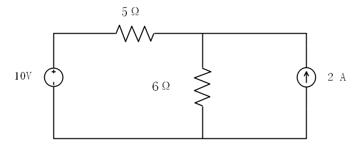
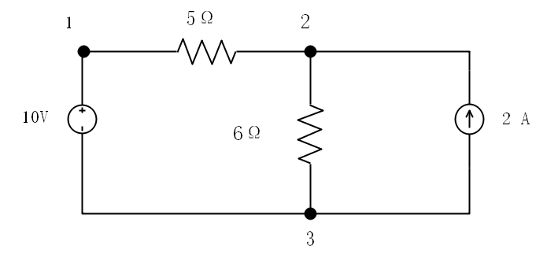

##### Ohm's Law

Conductance is a measure of how well an element will conduct electric current. The unit of conductance is Siemens.
$$
G =\frac{1}{r}=\frac{i}{v}
$$

1 S =1 A\V

In the circuit shown in Fig 2.8, calculate the current i, the conductance  G, and the power p.

Figure 2.8

Solution:

The voltage across the resistor is the same as the source voltage . Hence the current is
$$
i =\frac{v}{R}=\frac{30}{5\times10^3}= 6mA
$$
The conductance is 
$$
G =\frac{1}{R}=\frac{1}{5\times10^3}= 0.2 mS
$$
We can calculate the power in various ways using either Eqs.
$$
p = vi =30(6\times10^{-3}) = 180 mW
$$
or
$$
p = i^2R = (6\times10^{-3})^25\times10^3=180 mW
$$
or
$$
p = v^2G = 30^2\times0.2\times10^{-3} = 180 mW
$$

> A branch represents a single element such as a voltage or a resistor.

> Anode is the **point** of connection between two or more branches.

> A loop is any **closed path** in a circuit.

Determine the number of branches and nodes in the circuit shown in Fig. 2.12. Identify which elements are in parallel.

Figure 2.12

Solution：

There are four elements in the circuit, the circuit has four branches:10V, 5Ω, 6Ω, and 2A. The circuit has there nodes, identified in Fig 2.13. The 5-Ω resistor is in series with the 10-V voltage source because the same current would flow in both. The 6-Ω resistor is in parallel with the 2-A current source because both are connected to the same node 2 and 3.

Figure 2.13
