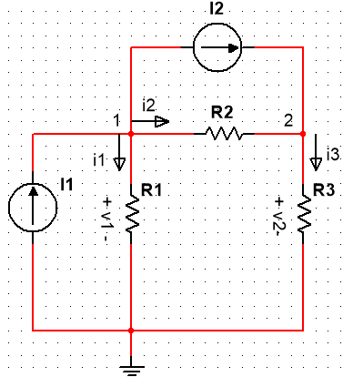

### Nodal analysis and Mesh analysis

1. select a node as the reference node(ground). Assign voltages v1, v2, ..., vn-1 to the remain n-1 nodes.

2.  Apply KCL to each of the n-1 nonreference nodes. Use Ohm's Law to express the branch currents in terms of voltages.

3. Solve the resulting simultaneous equations to obtain the unknow node voltages.

   Typical circuit for nodal analysis.

   

   
Figure 3.2(a)

Redraw the circuit in Figure 3.2(b),

Figure 3.2(b)

At node 1, applying KCL gives
$$
I1 = I2 + i1 + i2
$$
At node 2,
$$
I2 + i2 = i3
$$
Apply Ohm's Law to express  the currents i1, i2, and i3 in terms of node voltages.

The resistance is a passive element, by the passive sign convention, current must always flow from a higher potential to a lower potential.
$$
i = \frac{Vhigher - Vlower}{R}
$$
Note that this principle in agreement with the way we defined in resistance. It could be obtained that:
$$
i1 = \frac{V1 - 0}{R1}
$$

$$
i2 = \frac{V1 - V2}{R2}
$$

$$
i3 = \frac{V2 - 0}{R3}
$$

Substitute all i1 to i3 into the above equations, respectively, and the new equations can be got,
$$
I1 = I2 + \frac{V1 - 0}{R1} + \frac{V1 - V2}{R2}
$$

$$
I2 + \frac{V1 - V2}{R2} = \frac{V2 - 0}{R3}
$$

In terms of the conductance, the equation can be shown down below,
$$
I1 = I2 + G1V1 + G2(V1 - V2)
$$

$$
I2 + G2(V1-V2) = G3V2
$$

$$
\left[\begin{matrix}G1 + G2 & -G2 \\-G2 & G2 + G3 \\\end{matrix} \right] +
\left[\begin{matrix}V1 \\V2\\\end{matrix}\right] =
\left[\begin{matrix}I1 - I2 \\I2\\\end{matrix}\right]
$$

With software such as MATLAB, the results could be easily solved.

Example 3.1 Calculate the node voltages in the circuit shown in Figure 3.3(a).

Figure 3.3(a)

Define current i1 , which flows down into R1, i2 flows from right into R2,  i3 flows flows down into R3.
At node 1,  applying KCL and Ohm's Law gives 
$$
I1 = i1 + i2 \\
5 = \frac{V1 - V2}{4} + \frac{V1 - 0}{2}\\
3V1 - V2 = 20\\
$$
At node 2, do the same thing and get
$$
i2 + I2 = i1 + i3 \\
\frac{V1 - V2}{4} + 10 = 5+  \frac{V2 - 0}{6}\\
3V1 - V2 = 20
$$
To use Cramer's rule, we could put the equations in matrix as
$$
\left[\begin{matrix}3 & -1\\-3 & 5 \end{matrix} \right] 
\left[\begin{matrix}V1 \\V2\end{matrix}\right] =
\left[\begin{matrix}20 \\60\end{matrix}\right]
$$
Let's apply this into MATLAB.

<video id="video" controls="" preload="none">
    <source id="mp4" src="nodal analysis.mp4" type="video/mp4">
</video>